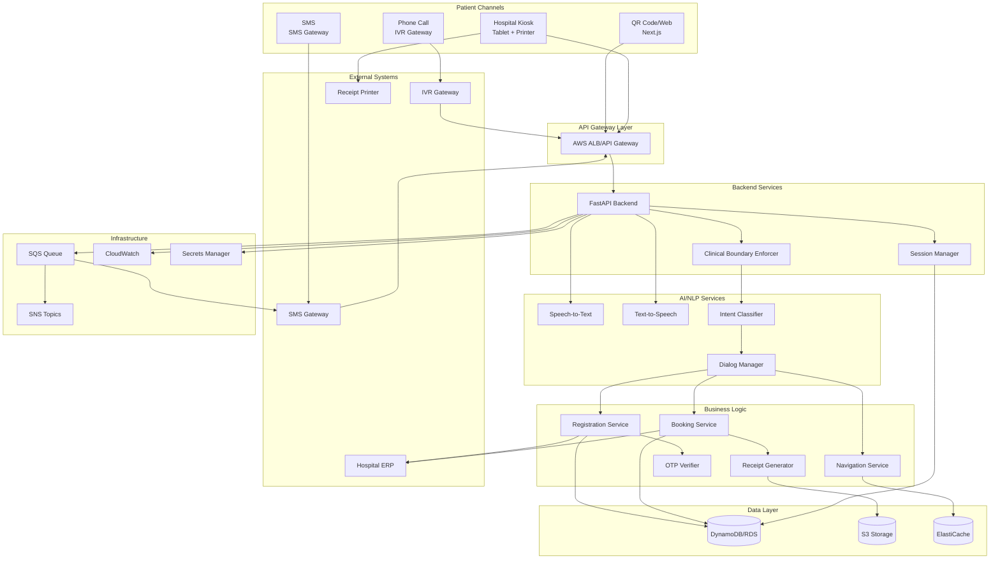
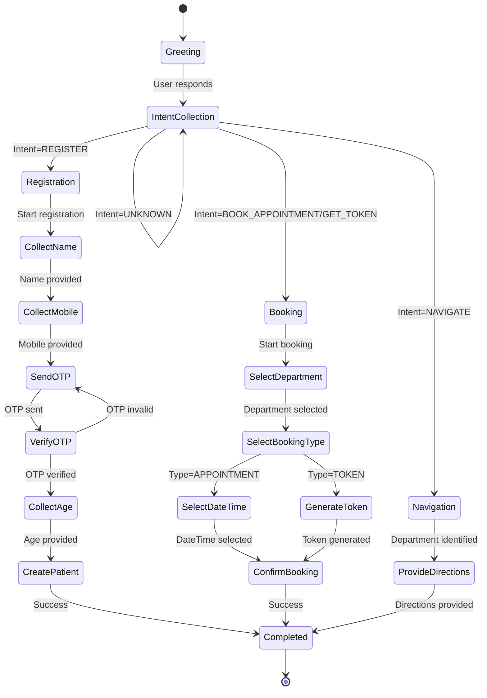

# Design Document: AI-Powered Hospital Front Desk System

## Overview

The AI-powered hospital front desk system is a voice-first, multi-channel digital assistant that replaces traditional physical hospital front desks. The system architecture follows a microservices pattern with clear separation between frontend channels, backend services, AI/NLP components, and external integrations.

The system is designed around three core principles:

1. **Channel Agnostic**: All business logic is centralized in backend services, with channel-specific adapters handling input/output formatting
2. **Clinical Boundary Enforcement**: A rule-based classifier sits at the entry point of all requests to reject clinical queries before they reach conversational AI
3. **Stateless API with Persistent Sessions**: REST APIs are stateless, but conversation context is maintained in a persistent session store

The architecture supports deployment on AWS cloud infrastructure with optional on-premises deployment for hospitals requiring local data residency.

## Architecture

### High-Level Architecture



### Component Responsibilities

**Frontend Channels:**
- **QR Code/Web (Next.js)**: Responsive web interface with voice and text input, audio playback, PDF download
- **Phone Call (IVR)**: Voice-only interaction through telephony gateway
- **SMS**: Text-based interaction with structured message parsing
- **Hospital Kiosk**: Tablet interface with voice-first UX, visual feedback, and printer integration

**API Gateway Layer:**
- Routes requests to backend services
- Implements rate limiting and DDoS protection
- Handles SSL termination
- Provides request/response logging

**Backend Services:**
- **FastAPI Backend**: Stateless REST API handling all business logic
- **Session Manager**: Maintains conversation state across multiple turns
- **Clinical Boundary Enforcer**: Rule-based filter that rejects clinical queries

**AI/NLP Services:**
- **Speech-to-Text**: Converts voice input to text (AWS Transcribe or Google Speech-to-Text)
- **Text-to-Speech**: Converts text responses to speech (AWS Polly or Google Text-to-Speech)
- **Intent Classifier**: Determines patient intent from natural language (rule-based + ML model)
- **Dialog Manager**: Manages conversation flow and determines next actions

**Business Logic:**
- **Registration Service**: Collects patient information and creates ERP records
- **Booking Service**: Handles appointment scheduling and queue token generation
- **Navigation Service**: Provides directions to hospital departments
- **Receipt Generator**: Creates PDF and printed receipts
- **OTP Verifier**: Sends and validates one-time passwords

**Data Layer:**
- **DynamoDB/RDS**: Stores sessions, bookings, patient records, audit logs
- **S3**: Stores PDF receipts and static assets
- **ElastiCache**: Caches hospital configuration (departments, services)

**External Systems:**
- **Hospital ERP**: Receives patient registrations and bookings
- **SMS Gateway**: Sends and receives text messages
- **IVR Gateway**: Handles phone call routing and audio streaming
- **Receipt Printer**: Prints physical receipts at kiosks

**Infrastructure:**
- **SQS**: Queues asynchronous tasks (SMS sending, ERP updates)
- **SNS**: Publishes notifications for admin alerts
- **CloudWatch**: Logs, metrics, and alarms
- **Secrets Manager**: Stores API keys and credentials

## Components and Interfaces

### 1. API Gateway and Request Router

**Responsibilities:**
- Route incoming requests to appropriate backend handlers
- Authenticate requests using API keys or JWT tokens
- Apply rate limiting per IP address and per hospital
- Log all requests for audit and debugging

**Interfaces:**

```typescript
// REST API Endpoints

POST /api/v1/session/start
Request: {
  channel: "qr" | "phone" | "sms" | "kiosk",
  hospitalId: string,
  language?: string,
  kioskId?: string,
  phoneNumber?: string
}
Response: {
  sessionId: string,
  greeting: string,
  audioUrl?: string
}

POST /api/v1/message
Request: {
  sessionId: string,
  message?: string,
  audioUrl?: string,
  intent?: string
}
Response: {
  sessionId: string,
  response: string,
  audioUrl?: string,
  actions?: Action[],
  completed: boolean
}

POST /api/v1/registration
Request: {
  sessionId: string,
  name: string,
  mobile: string,
  age: number,
  otpCode?: string
}
Response: {
  registrationId: string,
  patientId: string,
  receiptUrl?: string,
  success: boolean
}

POST /api/v1/booking
Request: {
  sessionId: string,
  patientId: string,
  department: string,
  bookingType: "appointment" | "token",
  preferredDate?: string,
  preferredTime?: string
}
Response: {
  bookingId: string,
  tokenNumber?: number,
  appointmentTime?: string,
  department: string,
  receiptUrl?: string,
  navigationInstructions: string
}

POST /api/v1/otp/send
Request: {
  mobile: string,
  hospitalId: string
}
Response: {
  otpId: string,
  expiresAt: string
}

POST /api/v1/otp/verify
Request: {
  otpId: string,
  code: string
}
Response: {
  verified: boolean
}

GET /api/v1/navigation
Request: {
  hospitalId: string,
  department: string,
  fromLocation?: string
}
Response: {
  instructions: string[],
  estimatedTime: number
}

GET /api/v1/health
Response: {
  status: "healthy" | "degraded" | "unhealthy",
  services: ServiceHealth[]
}
```

### 2. Session Manager

**Responsibilities:**
- Create and manage conversation sessions
- Store and retrieve session context
- Track conversation state and history
- Implement session timeout and cleanup

**Data Model:**

```typescript
interface Session {
  sessionId: string;
  hospitalId: string;
  channel: "qr" | "phone" | "sms" | "kiosk";
  language: string;
  state: "greeting" | "collecting_info" | "processing" | "completed";
  context: {
    patientName?: string;
    mobile?: string;
    age?: number;
    department?: string;
    intent?: string;
    collectedFields: string[];
    conversationHistory: Message[];
  };
  createdAt: string;
  lastActivityAt: string;
  expiresAt: string;
}

interface Message {
  role: "user" | "assistant";
  content: string;
  timestamp: string;
}
```

**Operations:**

```typescript
createSession(hospitalId: string, channel: string, language: string): Session
getSession(sessionId: string): Session | null
updateSession(sessionId: string, updates: Partial<Session>): Session
deleteSession(sessionId: string): void
cleanupExpiredSessions(): number
```

### 3. Clinical Boundary Enforcer

**Responsibilities:**
- Detect clinical queries using rule-based patterns
- Reject clinical requests before they reach conversational AI
- Log rejected queries for monitoring
- Provide standardized rejection messages

**Implementation:**

```python
class ClinicalBoundaryEnforcer:
    def __init__(self):
        self.clinical_keywords = [
            "diagnose", "diagnosis", "disease", "symptom", "medicine",
            "medication", "prescription", "treatment", "cure", "pain",
            "fever", "cough", "headache", "stomach", "chest", "blood",
            "pressure", "sugar", "diabetes", "cancer", "infection",
            "doctor advice", "medical advice", "health advice"
        ]
        
        self.clinical_patterns = [
            r"what (is|are) (my|the) (symptom|disease|problem)",
            r"(should i|can i) take (medicine|medication|drug)",
            r"(diagnose|treat|cure) (my|the|this)",
            r"(is it|could it be) (serious|dangerous|cancer|disease)"
        ]
    
    def is_clinical_query(self, text: str) -> bool:
        """Check if query is clinical using keywords and patterns"""
        pass
    
    def get_rejection_message(self, language: string) -> str:
        """Return standardized rejection message in patient's language"""
        pass
```

**Rejection Messages:**

- English: "I can help you with registration, appointments, and hospital navigation, but I cannot provide medical advice. Please speak with a doctor for medical questions."
- Hindi: "मैं आपको पंजीकरण, अपॉइंटमेंट और अस्पताल नेविगेशन में मदद कर सकता हूं, लेकिन मैं चिकित्सा सलाह नहीं दे सकता। कृपया चिकित्सा प्रश्नों के लिए डॉक्टर से बात करें।"

### 4. Intent Classifier

**Responsibilities:**
- Classify patient intent from natural language input
- Support multiple languages
- Handle ambiguous inputs with clarifying questions
- Provide confidence scores for classifications

**Intent Categories:**

```typescript
enum Intent {
  REGISTER = "register",
  BOOK_APPOINTMENT = "book_appointment",
  GET_TOKEN = "get_token",
  NAVIGATE = "navigate",
  CHECK_STATUS = "check_status",
  CANCEL_BOOKING = "cancel_booking",
  UNKNOWN = "unknown"
}

interface IntentResult {
  intent: Intent;
  confidence: number;
  entities: {
    department?: string;
    date?: string;
    time?: string;
    location?: string;
  };
}
```

**Implementation Approach:**

Hybrid approach combining rule-based and ML-based classification:

1. **Rule-Based Layer**: Fast pattern matching for common phrases
   - "I want to register" → REGISTER
   - "Book appointment" → BOOK_APPOINTMENT
   - "Where is cardiology" → NAVIGATE

2. **ML Layer**: Fine-tuned transformer model (multilingual BERT) for complex queries
   - Training data: Labeled conversations in Hindi and regional languages
   - Fallback when rule-based layer has low confidence

3. **Entity Extraction**: Named entity recognition for departments, dates, times

### 5. Dialog Manager

**Responsibilities:**
- Manage conversation flow based on intent and session state
- Determine what information to collect next
- Generate appropriate responses
- Handle conversation errors and clarifications

**State Machine:**



**Response Generation:**

```typescript
interface DialogResponse {
  text: string;
  audioUrl?: string;
  actions: Action[];
  nextState: string;
}

interface Action {
  type: "collect_field" | "call_service" | "generate_receipt" | "end_conversation";
  field?: string;
  service?: string;
  params?: Record<string, any>;
}
```

### 6. Registration Service

**Responsibilities:**
- Collect patient information (name, mobile, age)
- Validate input data
- Integrate with OTP Verifier for mobile verification
- Create patient records in ERP
- Generate registration receipts

**Workflow:**

```python
class RegistrationService:
    def __init__(self, otp_verifier, erp_client, receipt_generator):
        self.otp_verifier = otp_verifier
        self.erp_client = erp_client
        self.receipt_generator = receipt_generator
    
    async def register_patient(
        self,
        name: str,
        mobile: str,
        age: int,
        hospital_id: str,
        otp_code: Optional[str] = None
    ) -> RegistrationResult:
        """
        Register a new patient
        
        Steps:
        1. Validate input data
        2. Verify OTP if required
        3. Create patient record in ERP
        4. Generate registration receipt
        5. Return registration ID and receipt URL
        """
        pass
```

**Validation Rules:**

- Name: 2-100 characters, letters and spaces only
- Mobile: 10 digits, Indian format
- Age: 1-120 years
- OTP: 6 digits (if OTP verification enabled)

### 7. Booking Service

**Responsibilities:**
- Handle appointment scheduling and queue token generation
- Check availability for appointments
- Generate unique token numbers for queue
- Integrate with ERP for booking persistence
- Generate booking receipts with navigation instructions

**Data Models:**

```typescript
interface Appointment {
  appointmentId: string;
  patientId: string;
  hospitalId: string;
  department: string;
  doctorId?: string;
  dateTime: string;
  status: "scheduled" | "completed" | "cancelled";
  createdAt: string;
}

interface QueueToken {
  tokenId: string;
  tokenNumber: number;
  patientId: string;
  hospitalId: string;
  department: string;
  date: string;
  status: "waiting" | "called" | "completed" | "cancelled";
  createdAt: string;
}
```

**Operations:**

```typescript
checkAvailability(
  hospitalId: string,
  department: string,
  date: string,
  time: string
): boolean

bookAppointment(
  patientId: string,
  hospitalId: string,
  department: string,
  dateTime: string
): Appointment

generateToken(
  patientId: string,
  hospitalId: string,
  department: string
): QueueToken

cancelBooking(bookingId: string): boolean
```

**Token Number Generation:**

- Token numbers are sequential per department per day
- Format: `{DEPT_CODE}-{DATE}-{SEQUENCE}`
- Example: `CARD-20240115-042` (Cardiology, Jan 15 2024, 42nd patient)
- Sequence resets daily at midnight

### 8. Navigation Service

**Responsibilities:**
- Provide directions to hospital departments and facilities
- Support queries for departments, doctors, services
- Adapt directions based on patient's current location
- Cache hospital layout data for fast retrieval

**Data Model:**

```typescript
interface HospitalLayout {
  hospitalId: string;
  departments: Department[];
  landmarks: Landmark[];
  entrances: Entrance[];
}

interface Department {
  id: string;
  name: string;
  floor: number;
  wing: string;
  room: string;
  directions: DirectionSet[];
}

interface DirectionSet {
  fromLocation: string;
  steps: string[];
  estimatedTime: number;
}
```

**Direction Generation:**

```typescript
getDirections(
  hospitalId: string,
  department: string,
  fromLocation: string = "main_entrance"
): string[]

// Example output:
[
  "From the main entrance, walk straight for 50 meters",
  "Turn right at the pharmacy",
  "Take the elevator to the 2nd floor",
  "Turn left and walk to the end of the corridor",
  "Cardiology department is on your right"
]
```

### 9. Receipt Generator

**Responsibilities:**
- Generate PDF receipts for web and mobile channels
- Format receipts for SMS delivery
- Send print commands to kiosk printers
- Include all required information (patient name, booking details, navigation)

**Receipt Template:**

```
========================================
        [HOSPITAL NAME]
========================================

Registration/Appointment Receipt

Patient Name: [NAME]
Mobile: [MOBILE]
Age: [AGE]

[IF APPOINTMENT]
Appointment ID: [ID]
Department: [DEPARTMENT]
Date & Time: [DATETIME]

[IF TOKEN]
Token Number: [TOKEN]
Department: [DEPARTMENT]
Date: [DATE]

Navigation Instructions:
[INSTRUCTIONS]

Generated: [TIMESTAMP]
========================================
```

**Implementation:**

```python
class ReceiptGenerator:
    def generate_pdf(self, booking_data: dict) -> str:
        """Generate PDF receipt and upload to S3, return URL"""
        pass
    
    def format_sms(self, booking_data: dict) -> str:
        """Format receipt for SMS (160 char limit)"""
        pass
    
    def send_to_printer(self, booking_data: dict, printer_id: str) -> bool:
        """Send print command to kiosk printer"""
        pass
```

### 10. Speech Service

**Responsibilities:**
- Convert speech to text for voice channels
- Convert text to speech for voice responses
- Support multiple languages
- Handle audio streaming for phone calls

**Integration Options:**

1. **AWS Services:**
   - Amazon Transcribe for speech-to-text
   - Amazon Polly for text-to-speech
   - Supports Hindi and regional Indian languages

2. **Google Cloud Services:**
   - Google Speech-to-Text
   - Google Text-to-Speech
   - Better support for Indian accents and languages

**Implementation:**

```python
class SpeechService:
    async def transcribe(
        self,
        audio_url: str,
        language: str
    ) -> str:
        """Convert audio to text"""
        pass
    
    async def synthesize(
        self,
        text: str,
        language: str,
        voice: str = "female"
    ) -> str:
        """Convert text to speech, return audio URL"""
        pass
```

### 11. ERP Integration

**Responsibilities:**
- Create patient records in hospital ERP
- Create appointment and token records
- Handle ERP authentication and authorization
- Implement retry logic for failed calls
- Support multiple ERP systems (configurable per hospital)

**Interface:**

```python
class ERPClient:
    def __init__(self, base_url: str, api_key: str):
        self.base_url = base_url
        self.api_key = api_key
        self.retry_config = RetryConfig(max_attempts=3, backoff=2)
    
    async def create_patient(
        self,
        name: str,
        mobile: str,
        age: int
    ) -> str:
        """Create patient in ERP, return patient ID"""
        pass
    
    async def create_appointment(
        self,
        patient_id: str,
        department: str,
        date_time: str
    ) -> str:
        """Create appointment in ERP, return appointment ID"""
        pass
    
    async def create_token(
        self,
        patient_id: str,
        department: str,
        token_number: int
    ) -> str:
        """Create queue token in ERP, return token ID"""
        pass
```

**Error Handling:**

- Implement exponential backoff for retries
- Queue failed requests in SQS for later processing
- Send alerts to admins when ERP is unavailable
- Return user-friendly error messages to patients

### 12. Channel Adapters

**Responsibilities:**
- Adapt channel-specific input/output to unified API format
- Handle channel-specific features (audio streaming, printer commands)
- Manage channel-specific authentication

**QR Code/Web Adapter (Next.js):**

```typescript
// Frontend component for voice interaction
const VoiceInterface = () => {
  const [isRecording, setIsRecording] = useState(false);
  const [sessionId, setSessionId] = useState<string | null>(null);
  
  const startSession = async () => {
    const response = await fetch('/api/v1/session/start', {
      method: 'POST',
      body: JSON.stringify({
        channel: 'qr',
        hospitalId: getHospitalIdFromQR(),
        language: 'hi'
      })
    });
    const data = await response.json();
    setSessionId(data.sessionId);
    playAudio(data.audioUrl);
  };
  
  const sendMessage = async (text: string) => {
    const response = await fetch('/api/v1/message', {
      method: 'POST',
      body: JSON.stringify({
        sessionId,
        message: text
      })
    });
    const data = await response.json();
    playAudio(data.audioUrl);
    handleActions(data.actions);
  };
  
  // Voice recording and transcription
  // Text input handling
  // Audio playback
  // Receipt download
};
```

**Phone Call Adapter (IVR Gateway):**

```python
class PhoneCallAdapter:
    def __init__(self, ivr_gateway, api_client):
        self.ivr_gateway = ivr_gateway
        self.api_client = api_client
    
    async def handle_call(self, call_id: str, phone_number: str):
        """
        Handle incoming phone call
        
        1. Start session with phone channel
        2. Stream greeting audio
        3. Listen for speech input
        4. Transcribe and send to API
        5. Stream response audio
        6. Repeat until conversation ends
        7. Send SMS summary
        """
        pass
```

**SMS Adapter:**

```python
class SMSAdapter:
    def __init__(self, sms_gateway, api_client):
        self.sms_gateway = sms_gateway
        self.api_client = api_client
    
    async def handle_incoming_sms(self, from_number: str, message: str):
        """
        Handle incoming SMS
        
        Parse structured commands:
        - "REG <name> <age>" - Register
        - "BOOK <department> <date>" - Book appointment
        - "TOKEN <department>" - Get token
        - "NAV <department>" - Get directions
        """
        pass
    
    async def send_sms(self, to_number: str, message: str):
        """Send SMS via gateway"""
        pass
```

**Kiosk Adapter:**

```typescript
// Kiosk-specific features
const KioskInterface = () => {
  const [printerStatus, setPrinterStatus] = useState<'ready' | 'busy' | 'error'>('ready');
  
  const printReceipt = async (receiptData: any) => {
    // Send print command to local printer
    await fetch('/api/kiosk/print', {
      method: 'POST',
      body: JSON.stringify(receiptData)
    });
  };
  
  const resetAfterInactivity = () => {
    // Reset to home screen after 30 seconds
    setTimeout(() => {
      window.location.href = '/';
    }, 30000);
  };
  
  // Voice interaction
  // Visual feedback
  // Language selection
  // Offline mode with sync
};
```

## Data Models

### Database Schema

**Sessions Table (DynamoDB):**

```typescript
{
  PK: "SESSION#<sessionId>",
  SK: "METADATA",
  sessionId: string,
  hospitalId: string,
  channel: string,
  language: string,
  state: string,
  context: object,
  createdAt: string,
  lastActivityAt: string,
  expiresAt: string,
  TTL: number  // DynamoDB TTL for auto-cleanup
}
```

**Patients Table (RDS PostgreSQL):**

```sql
CREATE TABLE patients (
  patient_id UUID PRIMARY KEY DEFAULT gen_random_uuid(),
  hospital_id VARCHAR(50) NOT NULL,
  name VARCHAR(100) NOT NULL,
  mobile VARCHAR(10) NOT NULL,
  age INTEGER NOT NULL,
  created_at TIMESTAMP DEFAULT CURRENT_TIMESTAMP,
  updated_at TIMESTAMP DEFAULT CURRENT_TIMESTAMP,
  UNIQUE(hospital_id, mobile)
);

CREATE INDEX idx_patients_hospital_mobile ON patients(hospital_id, mobile);
```

**Appointments Table (RDS PostgreSQL):**

```sql
CREATE TABLE appointments (
  appointment_id UUID PRIMARY KEY DEFAULT gen_random_uuid(),
  patient_id UUID NOT NULL REFERENCES patients(patient_id),
  hospital_id VARCHAR(50) NOT NULL,
  department VARCHAR(100) NOT NULL,
  doctor_id VARCHAR(50),
  appointment_time TIMESTAMP NOT NULL,
  status VARCHAR(20) NOT NULL DEFAULT 'scheduled',
  created_at TIMESTAMP DEFAULT CURRENT_TIMESTAMP,
  updated_at TIMESTAMP DEFAULT CURRENT_TIMESTAMP,
  FOREIGN KEY (patient_id) REFERENCES patients(patient_id)
);

CREATE INDEX idx_appointments_hospital_date ON appointments(hospital_id, appointment_time);
CREATE INDEX idx_appointments_patient ON appointments(patient_id);
```

**Queue Tokens Table (RDS PostgreSQL):**

```sql
CREATE TABLE queue_tokens (
  token_id UUID PRIMARY KEY DEFAULT gen_random_uuid(),
  token_number INTEGER NOT NULL,
  patient_id UUID NOT NULL REFERENCES patients(patient_id),
  hospital_id VARCHAR(50) NOT NULL,
  department VARCHAR(100) NOT NULL,
  token_date DATE NOT NULL,
  status VARCHAR(20) NOT NULL DEFAULT 'waiting',
  created_at TIMESTAMP DEFAULT CURRENT_TIMESTAMP,
  updated_at TIMESTAMP DEFAULT CURRENT_TIMESTAMP,
  FOREIGN KEY (patient_id) REFERENCES patients(patient_id),
  UNIQUE(hospital_id, department, token_date, token_number)
);

CREATE INDEX idx_tokens_hospital_dept_date ON queue_tokens(hospital_id, department, token_date);
```

**Audit Logs Table (RDS PostgreSQL):**

```sql
CREATE TABLE audit_logs (
  log_id UUID PRIMARY KEY DEFAULT gen_random_uuid(),
  hospital_id VARCHAR(50) NOT NULL,
  event_type VARCHAR(50) NOT NULL,
  entity_type VARCHAR(50) NOT NULL,
  entity_id VARCHAR(100) NOT NULL,
  user_id VARCHAR(100),
  details JSONB,
  ip_address VARCHAR(45),
  timestamp TIMESTAMP DEFAULT CURRENT_TIMESTAMP
);

CREATE INDEX idx_audit_hospital_time ON audit_logs(hospital_id, timestamp);
CREATE INDEX idx_audit_entity ON audit_logs(entity_type, entity_id);
```

**Hospital Configuration (ElastiCache/Redis):**

```typescript
// Cached hospital configuration
{
  "hospital:<hospitalId>": {
    hospitalId: string,
    name: string,
    departments: [
      {
        id: string,
        name: string,
        floor: number,
        wing: string,
        availableSlots: string[]
      }
    ],
    languages: string[],
    otpEnabled: boolean,
    erpConfig: {
      baseUrl: string,
      authType: string
    }
  }
}
```

### S3 Bucket Structure

```
hospital-ai-receipts/
  {hospitalId}/
    {year}/
      {month}/
        {day}/
          {receiptId}.pdf
```

### SQS Queue Messages

**SMS Queue:**

```json
{
  "messageType": "sms",
  "to": "+919876543210",
  "body": "Your appointment is confirmed. Token: CARD-20240115-042. Department: Cardiology. Date: 15 Jan 2024.",
  "priority": "normal"
}
```

**ERP Sync Queue:**

```json
{
  "messageType": "erp_sync",
  "operation": "create_patient",
  "hospitalId": "hospital_001",
  "data": {
    "name": "John Doe",
    "mobile": "9876543210",
    "age": 35
  },
  "retryCount": 0,
  "maxRetries": 3
}
```


## Correctness Properties

A property is a characteristic or behavior that should hold true across all valid executions of a system—essentially, a formal statement about what the system should do. Properties serve as the bridge between human-readable specifications and machine-verifiable correctness guarantees.

### Property Reflection

After analyzing all acceptance criteria, I identified several areas of redundancy:

1. **Receipt content properties (2.4, 4.2, 7.1)**: These all test that receipts contain required information. Consolidated into a single comprehensive property.

2. **ERP integration properties (1.3, 9.1)**: Both test patient record creation in ERP. Consolidated into one property.

3. **Language support properties (6.5, 18.1)**: Both test multi-language support. Consolidated into one property.

4. **Clarifying questions properties (6.7, 17.4)**: Both test handling of unclear input. Consolidated into one property.

5. **Clinical boundary properties (5.1-5.4)**: All test rejection of clinical queries. Consolidated into one comprehensive property covering all clinical query types.

6. **Session state properties (3.6, 6.6, 8.4)**: All test session state management. Consolidated into one comprehensive property.

7. **Channel-specific receipt properties (7.2-7.5)**: Can be combined into one property that tests receipt format per channel.

### Core Properties

**Property 1: Registration data collection completeness**

*For any* patient registration request across any channel (QR, phone, SMS, kiosk), the Registration_Service should collect and store exactly three fields: name, mobile number, and age.

**Validates: Requirements 1.1**

---

**Property 2: OTP verification enforcement**

*For any* hospital configuration where OTP verification is enabled, when a patient provides a mobile number during registration, the system should send an OTP and block registration completion until the OTP is successfully verified.

**Validates: Requirements 1.2**

---

**Property 3: ERP integration for patient records**

*For any* completed patient registration, the ERP_Integration should receive a create patient call with the exact patient data (name, mobile, age) that was collected.

**Validates: Requirements 1.3, 9.1**

---

**Property 4: Registration receipt generation**

*For any* successful registration, the Receipt_Generator should create a receipt containing at minimum the patient's name, mobile number, and registration ID.

**Validates: Requirements 1.4**

---

**Property 5: Incomplete data prompting**

*For any* registration attempt with missing required fields (name, mobile, or age), the AI_Assistant should prompt for the specific missing fields before proceeding.

**Validates: Requirements 1.5**

---

**Property 6: Clinical data exclusion from registration**

*For any* registration interaction, if clinical information (medical history, symptoms, diagnoses) is provided, the Registration_Service should not store this information in the patient record.

**Validates: Requirements 1.6, 11.4**

---

**Property 7: Appointment data collection**

*For any* appointment booking request, the AI_Assistant should collect both the department/service name and the preferred date/time before proceeding to book.

**Validates: Requirements 2.1**

---

**Property 8: Queue token uniqueness and sequencing**

*For any* department and date combination, when multiple queue tokens are generated, each token number should be unique and sequential within that department-date scope.

**Validates: Requirements 2.2**

---

**Property 9: Appointment availability verification**

*For any* appointment booking request, the Booking_Service should check slot availability before confirming the appointment.

**Validates: Requirements 2.3**

---

**Property 10: Booking receipt completeness**

*For any* confirmed booking (appointment or token), the generated receipt should contain all of: patient name, booking ID (token or appointment ID), department, date/time, and navigation instructions.

**Validates: Requirements 2.4, 4.2, 7.1**

---

**Property 11: SMS confirmation delivery**

*For any* confirmed booking, the system should send an SMS confirmation to the patient's mobile number containing the booking details.

**Validates: Requirements 2.5**

---

**Property 12: Alternative slot suggestion**

*For any* appointment request where the requested time slot is unavailable, the AI_Assistant should suggest at least one alternative available slot.

**Validates: Requirements 2.6**

---

**Property 13: Booking persistence round-trip**

*For any* booking (appointment or token), immediately after creation, querying the database with the booking ID should return the same booking with all its details.

**Validates: Requirements 2.7**

---

**Property 14: SMS command parsing and processing**

*For any* valid SMS command format (e.g., "REG <name> <age>", "TOKEN <department>"), the system should correctly parse the command and execute the corresponding operation.

**Validates: Requirements 3.4, 15.1**

---

**Property 15: Session state persistence across conversation turns**

*For any* multi-turn conversation on any channel, information collected in earlier turns (e.g., patient name) should remain available in later turns without requiring the patient to repeat it.

**Validates: Requirements 3.6, 6.6, 8.4**

---

**Property 16: Cross-channel functional consistency**

*For any* operation (registration, booking, navigation) performed on different channels with the same input data, the outcomes should be equivalent (same data stored, same receipts generated).

**Validates: Requirements 3.7**

---

**Property 17: Navigation instruction generation**

*For any* valid department name and starting location, the Navigation_Service should return a non-empty list of step-by-step directions.

**Validates: Requirements 4.1, 4.3**

---

**Property 18: Context-aware navigation**

*For any* department, when requesting directions from different starting locations (main entrance vs. kiosk location), the Navigation_Service should return different direction sets appropriate to each starting point.

**Validates: Requirements 4.4**

---

**Property 19: Clinical query rejection**

*For any* input containing clinical keywords (diagnosis, medicine, symptoms, treatment, health advice), the Clinical_Boundary should detect it and the AI_Assistant should refuse with an explanation, without processing the clinical request.

**Validates: Requirements 5.1, 5.2, 5.3, 5.4, 5.6**

---

**Property 20: Non-clinical data collection only**

*For any* conversation, the system should only collect and store administrative information (name, mobile, age, department, date/time) and should not collect or store clinical information (symptoms, medical history, diagnoses).

**Validates: Requirements 5.5**

---

**Property 21: Speech-to-text and text-to-speech round-trip**

*For any* text input in a supported language, converting it to speech (text-to-speech) and then back to text (speech-to-text) should produce semantically equivalent text.

**Validates: Requirements 6.2, 6.3**

---

**Property 22: Intent classification accuracy**

*For any* natural language input that clearly expresses a supported intent (register, book appointment, get token, navigate), the Intent_Classifier should correctly identify that intent with high confidence.

**Validates: Requirements 6.4**

---

**Property 23: Multi-language support**

*For any* supported language (Hindi and configured regional languages), the AI_Assistant should accept input in that language and respond in the same language.

**Validates: Requirements 6.5, 18.1**

---

**Property 24: Clarification for ambiguous input**

*For any* input where the Intent_Classifier has low confidence or cannot determine intent, the AI_Assistant should ask clarifying questions rather than proceeding with an incorrect assumption.

**Validates: Requirements 6.7, 17.4**

---

**Property 25: Channel-specific receipt format**

*For any* completed transaction, the receipt format should match the channel: PDF for QR/web, SMS text for SMS channel, print command for kiosk, SMS for phone calls.

**Validates: Requirements 7.2, 7.3, 7.4, 7.5**

---

**Property 26: Receipt format consistency**

*For any* booking, regardless of channel, the receipt should contain the same core information (patient name, booking ID, department, date/time, navigation) even if the format differs.

**Validates: Requirements 7.6**

---

**Property 27: Session persistence across service restarts**

*For any* active session, if the backend service restarts, retrieving the session by ID should return the same session state that existed before the restart.

**Validates: Requirements 8.2**

---

**Property 28: Session ID uniqueness**

*For any* set of concurrently created sessions, all session IDs should be unique.

**Validates: Requirements 8.3**

---

**Property 29: Input validation and error responses**

*For any* API endpoint, when provided with invalid input data (wrong types, missing required fields, out-of-range values), the API should return an error response with a clear error message and appropriate HTTP status code.

**Validates: Requirements 8.6**

---

**Property 30: Rate limiting enforcement**

*For any* client making requests to the API, when the request rate exceeds the configured limit, subsequent requests should be rejected with a 429 (Too Many Requests) status code.

**Validates: Requirements 8.7**

---

**Property 31: ERP integration for appointments and tokens**

*For any* confirmed appointment or generated token, the ERP_Integration should receive a corresponding create call with the booking details.

**Validates: Requirements 9.2, 9.3**

---

**Property 32: ERP retry with exponential backoff**

*For any* failed ERP call, the system should retry the call with exponentially increasing delays between attempts (e.g., 1s, 2s, 4s).

**Validates: Requirements 9.4, 17.1**

---

**Property 33: ERP failure logging and notification**

*For any* ERP call that fails after all retry attempts, the system should create an error log entry and send a notification to hospital administrators.

**Validates: Requirements 9.5**

---

**Property 34: Configurable ERP endpoints**

*For any* hospital with a configured ERP endpoint and authentication method, the ERP_Integration should use that hospital's specific configuration when making ERP calls.

**Validates: Requirements 9.6**

---

**Property 35: Minimal PII storage**

*For any* patient record in the database, the stored fields should be limited to name, mobile number, age, and system-generated IDs, with no additional personal information.

**Validates: Requirements 11.3**

---

**Property 36: Audit log creation**

*For any* registration, booking, or admin action, an audit log entry should be created containing the event type, entity ID, timestamp, and user identifier.

**Validates: Requirements 11.5**

---

**Property 37: Data retention policy enforcement**

*For any* hospital with a configured data retention period, patient records older than the retention period should be automatically deleted.

**Validates: Requirements 11.6**

---

**Property 38: Data deletion on request**

*For any* patient record, when a deletion request is made with the patient ID, the record should be removed from the database and no longer retrievable.

**Validates: Requirements 11.7**

---

**Property 39: Role-based access control**

*For any* admin operation, when attempted by a user without the required role, the operation should be rejected with an authorization error.

**Validates: Requirements 11.8, 14.7**

---

**Property 40: Cache hit for frequently accessed data**

*For any* hospital configuration data (departments, services), the first access should query the database, but subsequent accesses within the cache TTL should be served from cache without database queries.

**Validates: Requirements 12.5**

---

**Property 41: Circuit breaker opening on failures**

*For any* external service (ERP, SMS gateway), when consecutive calls fail beyond a threshold, the circuit breaker should open and subsequent calls should fail fast without attempting the external call.

**Validates: Requirements 12.6**

---

**Property 42: Multi-hospital data isolation**

*For any* two different hospitals, patient records, bookings, and sessions created for hospital A should not be accessible when querying with hospital B's ID.

**Validates: Requirements 13.1**

---

**Property 43: Hospital identification from channel**

*For any* patient access through a channel (QR code, phone number, kiosk), the system should correctly identify the hospital ID from the channel identifier.

**Validates: Requirements 13.2**

---

**Property 44: Hospital-specific ERP routing**

*For any* ERP operation for a specific hospital, the ERP_Integration should call the ERP endpoint configured for that hospital, not other hospitals' ERPs.

**Validates: Requirements 13.3**

---

**Property 45: Hospital-specific configuration application**

*For any* hospital with specific configuration (departments, languages, OTP settings), operations for that hospital should use its configuration, not other hospitals' configurations.

**Validates: Requirements 13.4**

---

**Property 46: Hospital-specific analytics isolation**

*For any* analytics query for a specific hospital, the returned data should only include registrations, bookings, and sessions for that hospital.

**Validates: Requirements 13.5**

---

**Property 47: Analytics data completeness**

*For any* analytics query, the returned data should include all required metrics: daily registrations count, bookings count, channel usage breakdown, and peak hours.

**Validates: Requirements 14.2**

---

**Property 48: Configuration persistence**

*For any* configuration change made through the admin interface (adding a department, changing OTP setting), the change should be persisted and reflected in subsequent operations.

**Validates: Requirements 14.3**

---

**Property 49: Health metrics availability**

*For any* health metrics query, the system should return current values for API response times, error rates, and resource usage.

**Validates: Requirements 14.4**

---

**Property 50: Audit log accessibility**

*For any* audit log query with filters (date range, event type), the system should return matching audit log entries.

**Validates: Requirements 14.5**

---

**Property 51: Analytics export format**

*For any* analytics export request in CSV or PDF format, the system should generate a file in the requested format containing the analytics data.

**Validates: Requirements 14.6**

---

**Property 52: Real-time speech-to-text streaming**

*For any* audio stream during a phone call, the Speech_Service should produce text transcription with latency under 2 seconds.

**Validates: Requirements 15.5**

---

**Property 53: Real-time text-to-speech streaming**

*For any* text response during a phone call, the Speech_Service should produce audio with latency under 2 seconds.

**Validates: Requirements 15.6**

---

**Property 54: Call disconnection SMS summary**

*For any* phone call that disconnects before conversation completion, the system should send an SMS to the patient's number with a summary of the conversation state.

**Validates: Requirements 15.7**

---

**Property 55: Kiosk print command generation**

*For any* completed transaction at a kiosk, the Receipt_Generator should send a print command to the kiosk's configured printer with the receipt data.

**Validates: Requirements 16.4**

---

**Property 56: Kiosk inactivity timeout**

*For any* kiosk session, if no user interaction occurs for 30 seconds, the kiosk interface should reset to the home screen.

**Validates: Requirements 16.6**

---

**Property 57: Kiosk offline mode with sync**

*For any* kiosk operating offline, operations should be queued locally, and when connectivity is restored, all queued operations should be synced to the backend.

**Validates: Requirements 16.7**

---

**Property 58: Database error logging and user-friendly messages**

*For any* database operation failure, the system should log the technical error details and return a user-friendly error message to the patient (not exposing technical details).

**Validates: Requirements 17.2**

---

**Property 59: Speech recognition fallback**

*For any* speech input that the Speech_Service fails to recognize with confidence, the AI_Assistant should ask the patient to repeat or offer text input as an alternative.

**Validates: Requirements 17.3**

---

**Property 60: Critical error alerting**

*For any* critical error (database unavailable, ERP down for extended period, service crash), the system should send an alert notification to hospital administrators.

**Validates: Requirements 17.6**

---

**Property 61: Language detection from input**

*For any* initial patient input in a supported language, the system should detect the language and continue the conversation in that language.

**Validates: Requirements 18.2**

---

**Property 62: Slow speech recognition tolerance**

*For any* speech input with slow speaking rate (typical of elderly patients), the Speech_Service should still correctly transcribe the speech.

**Validates: Requirements 18.6**

---

## Error Handling

### Error Categories

**1. User Input Errors:**
- Invalid data format (non-numeric age, invalid mobile number)
- Missing required fields
- Ambiguous or unclear requests

**Response Strategy:**
- Return clear, actionable error messages
- Prompt for correction with examples
- Never expose technical details to patients

**2. External Service Errors:**
- ERP unavailable
- SMS gateway failure
- Speech service timeout

**Response Strategy:**
- Implement retry with exponential backoff
- Queue requests for later processing
- Provide fallback options (e.g., SMS if voice fails)
- Alert administrators for prolonged outages

**3. System Errors:**
- Database connection failure
- Out of memory
- Service crash

**Response Strategy:**
- Log detailed error information
- Return generic user-friendly message
- Trigger automatic service restart
- Send critical alerts to administrators

**4. Clinical Boundary Violations:**
- Patient asks for diagnosis
- Patient requests medicine suggestions
- Patient describes symptoms for interpretation

**Response Strategy:**
- Detect using Clinical_Boundary enforcer
- Refuse politely with explanation
- Redirect to appropriate hospital staff
- Log for monitoring and improvement

### Error Response Format

```typescript
interface ErrorResponse {
  error: {
    code: string;
    message: string;
    userMessage: string;
    details?: any;
  };
  requestId: string;
  timestamp: string;
}
```

### Retry Configuration

```python
class RetryConfig:
    max_attempts: int = 3
    initial_delay: float = 1.0  # seconds
    max_delay: float = 30.0
    exponential_base: float = 2.0
    jitter: bool = True
```

### Circuit Breaker Configuration

```python
class CircuitBreakerConfig:
    failure_threshold: int = 5  # failures before opening
    success_threshold: int = 2  # successes before closing
    timeout: float = 60.0  # seconds in open state
    half_open_max_calls: int = 1  # calls allowed in half-open state
```

## Testing Strategy

### Dual Testing Approach

The system requires both unit testing and property-based testing for comprehensive coverage:

**Unit Tests:**
- Specific examples demonstrating correct behavior
- Edge cases (empty input, boundary values, special characters)
- Error conditions (invalid input, service failures)
- Integration points between components
- Channel-specific functionality (QR code scanning, printer commands)

**Property-Based Tests:**
- Universal properties that hold for all inputs
- Comprehensive input coverage through randomization
- Minimum 100 iterations per property test
- Each property test references its design document property

**Property-Based Testing Library:**
- **Python (Backend)**: Use Hypothesis library
- **TypeScript (Frontend)**: Use fast-check library

**Test Configuration:**

```python
# Python/Hypothesis example
from hypothesis import given, settings
import hypothesis.strategies as st

@settings(max_examples=100)
@given(
    name=st.text(min_size=2, max_size=100, alphabet=st.characters(whitelist_categories=('L', 'Zs'))),
    mobile=st.text(min_size=10, max_size=10, alphabet=st.characters(whitelist_categories=('Nd',))),
    age=st.integers(min_value=1, max_value=120)
)
def test_registration_data_collection(name, mobile, age):
    """
    Feature: hospital-ai-front-desk
    Property 1: Registration data collection completeness
    
    For any patient registration request, the Registration_Service should
    collect and store exactly three fields: name, mobile number, and age.
    """
    # Test implementation
    pass
```

```typescript
// TypeScript/fast-check example
import fc from 'fast-check';

test('Property 1: Registration data collection completeness', () => {
  fc.assert(
    fc.property(
      fc.string({ minLength: 2, maxLength: 100 }),
      fc.string({ minLength: 10, maxLength: 10 }),
      fc.integer({ min: 1, max: 120 }),
      (name, mobile, age) => {
        /**
         * Feature: hospital-ai-front-desk
         * Property 1: Registration data collection completeness
         * 
         * For any patient registration request, the Registration_Service should
         * collect and store exactly three fields: name, mobile number, and age.
         */
        // Test implementation
      }
    ),
    { numRuns: 100 }
  );
});
```

### Test Organization

**Backend Tests (Python):**
```
tests/
  unit/
    test_registration_service.py
    test_booking_service.py
    test_navigation_service.py
    test_clinical_boundary.py
    test_intent_classifier.py
    test_session_manager.py
    test_erp_integration.py
  property/
    test_registration_properties.py
    test_booking_properties.py
    test_navigation_properties.py
    test_clinical_boundary_properties.py
    test_session_properties.py
    test_erp_properties.py
  integration/
    test_api_endpoints.py
    test_channel_adapters.py
    test_end_to_end_flows.py
```

**Frontend Tests (TypeScript):**
```
tests/
  unit/
    components/
      VoiceInterface.test.tsx
      KioskInterface.test.tsx
    services/
      api-client.test.ts
  property/
    voice-interaction.property.test.ts
    session-management.property.test.ts
  e2e/
    registration-flow.e2e.test.ts
    booking-flow.e2e.test.ts
```

### Test Data Generation

**Hypothesis Strategies (Python):**

```python
import hypothesis.strategies as st

# Patient data
patient_names = st.text(min_size=2, max_size=100, alphabet=st.characters(whitelist_categories=('L', 'Zs')))
mobile_numbers = st.text(min_size=10, max_size=10, alphabet=st.characters(whitelist_categories=('Nd',)))
ages = st.integers(min_value=1, max_value=120)

# Departments
departments = st.sampled_from(['Cardiology', 'Neurology', 'Orthopedics', 'Pediatrics', 'General Medicine'])

# Dates and times
dates = st.dates(min_value=date.today(), max_value=date.today() + timedelta(days=90))
times = st.times(min_value=time(8, 0), max_value=time(18, 0))

# Channels
channels = st.sampled_from(['qr', 'phone', 'sms', 'kiosk'])

# Languages
languages = st.sampled_from(['en', 'hi', 'ta', 'te', 'bn'])

# Clinical keywords (for boundary testing)
clinical_keywords = st.sampled_from([
    'diagnose my symptoms',
    'what medicine should I take',
    'is this cancer',
    'I have chest pain what should I do',
    'suggest treatment for fever'
])
```

**fast-check Arbitraries (TypeScript):**

```typescript
import fc from 'fast-check';

// Patient data
const patientName = fc.string({ minLength: 2, maxLength: 100 });
const mobileNumber = fc.string({ minLength: 10, maxLength: 10 });
const age = fc.integer({ min: 1, max: 120 });

// Departments
const department = fc.constantFrom('Cardiology', 'Neurology', 'Orthopedics', 'Pediatrics', 'General Medicine');

// Channels
const channel = fc.constantFrom('qr', 'phone', 'sms', 'kiosk');

// Languages
const language = fc.constantFrom('en', 'hi', 'ta', 'te', 'bn');

// Session IDs
const sessionId = fc.uuid();
```

### Integration Testing

**Key Integration Points:**
1. API Gateway → Backend Services
2. Backend → ERP System (mock ERP for testing)
3. Backend → SMS Gateway (mock gateway for testing)
4. Backend → Speech Services (mock for testing)
5. Frontend → Backend API
6. Kiosk → Printer (mock printer for testing)

**Integration Test Approach:**
- Use Docker Compose to spin up test environment
- Mock external services (ERP, SMS gateway, speech services)
- Test complete flows end-to-end
- Verify data flows correctly through all layers

### Performance Testing

**Load Testing:**
- Use Locust or k6 for load testing
- Simulate 10,000 concurrent sessions
- Measure API response times under load
- Verify auto-scaling triggers correctly

**Stress Testing:**
- Gradually increase load beyond normal capacity
- Identify breaking points
- Verify graceful degradation
- Test recovery after stress

### Security Testing

**Penetration Testing:**
- SQL injection attempts
- XSS attempts in user input
- Authentication bypass attempts
- Rate limiting bypass attempts

**Data Security Testing:**
- Verify TLS encryption in transit
- Verify data encryption at rest
- Verify PII is not logged
- Verify audit logs are tamper-proof

### Monitoring and Observability

**Metrics to Track:**
- API response times (p50, p95, p99)
- Error rates by endpoint
- Session creation rate
- Registration completion rate
- Booking completion rate
- ERP integration success rate
- SMS delivery rate
- Speech service latency
- Cache hit rate
- Database connection pool usage

**Logging:**
- Structured JSON logs
- Request/response logging (excluding PII)
- Error logging with stack traces
- Audit logging for all data modifications

**Alerting:**
- API error rate > 5%
- API p95 latency > 3 seconds
- ERP integration failure rate > 10%
- Database connection pool exhaustion
- Service health check failures
- Critical errors (service crashes)

**Dashboards:**
- Real-time system health dashboard
- Per-hospital analytics dashboard
- Admin operations dashboard
- Error tracking dashboard
